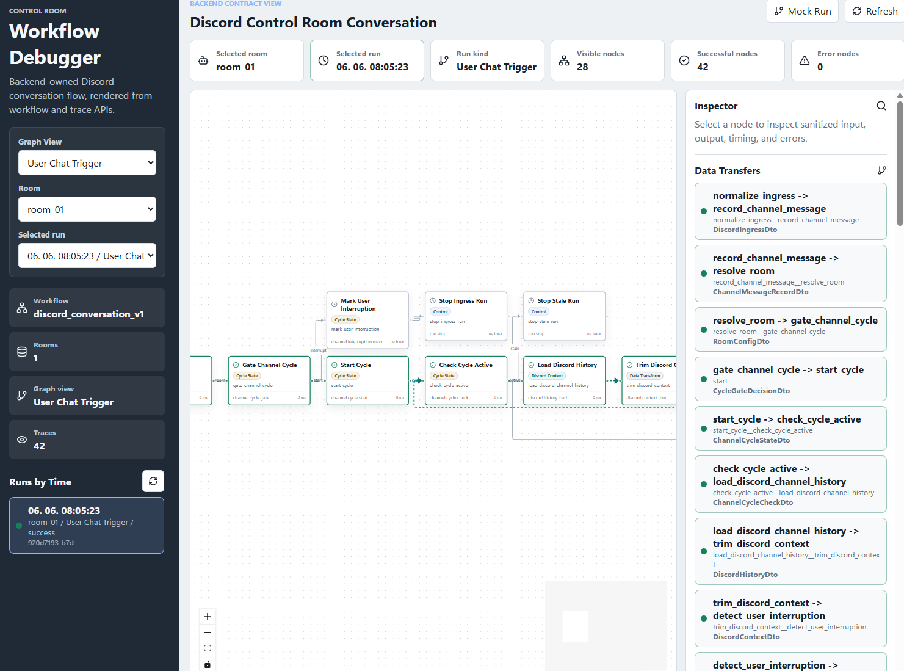
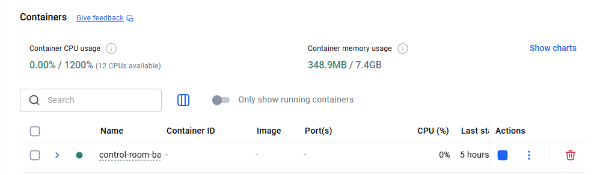
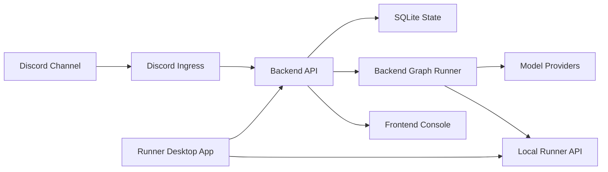

# Control Room

Discord 기반 AI Control Room 프로젝트의 공개 포트폴리오 문서입니다.

실제 운영 코드는 비공개입니다. 이 저장소는 프로젝트 구조, 구현 의사결정, 회고, 스크린샷을 정리한 포트폴리오용 문서 저장소입니다.

## Overview / 프로젝트 개요

Control Room은 Discord 채팅방을 조작 화면처럼 사용해 여러 AI 역할이 대화하고, 필요한 설정과 실행 상태는 로컬 웹 콘솔에서 관리하는 프로젝트입니다.

초기 목표는 **Discord를 통해 외부에서 내 로컬 PC의 AI에게 작업을 지시하는 control room**을 만드는 것이었습니다. 예를 들어 모바일 Discord에서 명령을 보내면, 집이나 작업 PC에 떠 있는 로컬 runner가 AI/CLI 작업을 수행하는 구조를 상정했습니다.

다만 제작 도중 Codex Desktop 같은 대기업 도구들이 로컬 PC의 코딩 작업을 더 안정적으로 원격 지시할 수 있는 방향으로 발전하면서, 이 프로젝트에서 CLI 제어 기능을 계속 밀고 가는 실익은 줄어들었습니다. 그래서 CLI control 기능은 핵심 범위에서 제외하고, 프로젝트를 폐기하는 대신 **Discord 안에서 여러 역할의 AI agent가 멀티턴으로 토론하고 응답하는 시스템**에 집중하기로 방향을 전환했습니다.

## Why I Built It / 만든 이유

처음에는 Discord를 단순 채팅 UI가 아니라, 언제 어디서든 접근 가능한 remote command surface로 보고 출발했습니다. 웹 대시보드를 직접 열지 않아도 모바일에서 명령을 보내고, 로컬 PC에서 실행되는 AI runtime이 작업을 이어받는 구조를 만들고 싶었습니다.

이후 프로젝트 방향은 바뀌었습니다. 로컬 CLI 제어는 외부 도구들이 더 빠르게 성숙했기 때문에 직접 구현 우선순위에서 내려놓았고, 대신 이미 만들어둔 Discord 연동, 방 설정, 프롬프트 조립, 모델 설정 구조를 활용해 **멀티롤 AI 토론 봇**으로 발전시키는 편이 더 의미 있다고 판단했습니다.

이 과정에서 단순한 챗봇보다 중요한 것은 다음이었습니다.

- Discord 메시지를 안정적으로 수집하고 기록하는 것
- 한 채널에서 동시에 여러 cycle이 충돌하지 않게 관리하는 것
- conductor 역할의 agent가 다음 발화자와 대화 지속 여부를 결정하는 것
- assistant agent들이 각자의 역할과 context에 맞게 응답하는 것
- 실행 흐름과 prompt, model call, branch decision을 나중에 추적할 수 있게 만드는 것

## Local-first Deployment / 로컬 우선 실행 방식

이 프로젝트는 처음부터 상시 공개 웹서비스보다 **필요할 때 내 PC에서 Docker stack을 구동하는 방식**을 우선했습니다. 별도 도메인을 구매하거나 클라우드 서버를 항상 켜둘 필요가 없고, 개인용 AI control room에 필요한 비용과 운영 부담을 줄일 수 있기 때문입니다.

동시에 Docker 기반으로 구성했기 때문에 로컬 전용 구조에만 갇히지는 않습니다. 장기적으로는 같은 backend, frontend, runner 구성을 클라우드 VM이나 컨테이너 환경으로 옮겨 상시 실행 서비스처럼 운영할 수 있는 여지를 남겼습니다.

## Preview / Discord 대화 화면

Discord는 이 프로젝트의 주 사용 화면입니다. 사용자는 일반 채팅처럼 메시지를 보내고, 백엔드는 대화 흐름을 기록한 뒤 어떤 AI 역할이 다음에 말할지 조율합니다.

## Screenshots

| Discord Control Room | Frontend Console |
| --- | --- |
|  |  |
| [사용자 명령과 멀티턴 대화가 일어나는 화면](docs/discord-control-room.md) | [multi-agent prompt/persona 상태를 관리하는 운영 콘솔](docs/frontend-console.md) |

| Runner App | Workflow Debugger |
| --- | --- |
|  |  |
| [로컬 Docker stack, console, runner 상태를 확인하는 Windows 앱](docs/runner-app.md) | [backend node graph, run, trace 구조를 보여주는 workflow debugger](docs/backend-workflow-runtime.md) |

| Model Profiles | Secret References |
| --- | --- |
|  |  |
| [provider, model, parameter를 설정으로 교체하는 model profile 관리 화면](docs/frontend-console.md#model-profile-configuration) | [AI와 frontend는 placeholder만 다루고 실제 key는 backend가 숨기는 secret reference 화면](docs/security-notes.md#secret-boundary) |

### Prompt Assembly

[conductor/assistant role instruction fragment를 backend prompt compiler가 조립하는 구조](docs/prompt-assembly.md)

### Docker Local Runtime

[필요할 때 로컬 PC에서 Docker stack을 구동하고, 장기적으로 cloud/container 환경으로 옮길 수 있는 runtime 구조](docs/docker-local-runtime.md)

## Architecture / 아키텍처

역할은 단순하게 나눴습니다. Discord는 사용자가 말을 거는 화면이고, 백엔드는 대화를 기록하고 다음 응답을 만들기 위한 판단을 담당합니다. 프론트엔드는 AI 역할, 모델, 프롬프트, 실행 상태를 관리하는 콘솔이며, 러너는 로컬 PC에서 필요한 실행 환경을 켜고 확인하는 경계입니다.

## Components / 구성 요소

| Component | Role |
| --- | --- |
| Discord Ingress | Discord 메시지를 받아 백엔드에 전달합니다. |
| Backend API | 대화 상태를 저장하고, 다음 응답을 만들기 위한 판단과 기록을 담당합니다. |
| Frontend Console | AI 역할, 모델, 프롬프트, 시크릿 상태를 관리하고 실행 결과를 확인합니다. |
| Runner API | 로컬 PC에서 실행해야 하는 기능을 백엔드와 분리합니다. CLI 제어는 현재 핵심 범위에서 제외되었습니다. |
| Runner App | Docker stack과 로컬 콘솔 상태를 켜고 확인하는 Windows 앱입니다. |

자세한 내용: [Component Responsibilities](docs/components.md)

## Migration From Workflow Tools / n8n, Activepieces에서 전환한 이유

초기 구현은 n8n과 Activepieces로 시작했습니다. 백엔드를 직접 구축하는 것보다 workflow engine을 다루는 쪽이 익숙했고, 시각적으로 노드를 연결하면서 Discord, HTTP request, model call, branch logic을 빠르게 검증할 수 있었기 때문입니다.

하지만 대화 상태 관리, 사용자 개입 처리, 프롬프트 조립, 시크릿 관리, 실행 기록처럼 세밀하게 다뤄야 할 부분이 늘어나면서 workflow tool 안에 핵심 로직을 계속 두는 것이 오히려 불편해졌습니다. AI coding 도구가 발전하면서 TypeScript 백엔드를 직접 구축하는 비용도 낮아졌고, 결국 실행 권한과 상태 관리를 백엔드 코드로 옮기는 방향을 선택했습니다.

자세한 내용: [Migration From n8n and Activepieces](docs/migration-from-workflow-tools.md)

## Case Study Docs

- [Architecture](docs/architecture.md)
- [Component Responsibilities](docs/components.md)
- [Discord Control Room](docs/discord-control-room.md)
- [Backend-owned Workflow Runtime](docs/backend-workflow-runtime.md)
- [Backend API](docs/backend-api.md)
- [Frontend Console](docs/frontend-console.md)
- [Prompt Assembly](docs/prompt-assembly.md)
- [Runner App](docs/runner-app.md)
- [Runner API](docs/runner-api.md)
- [Docker Local Runtime](docs/docker-local-runtime.md)
- [Migration From n8n and Activepieces](docs/migration-from-workflow-tools.md)
- [Retrospective](docs/retrospective.md)
- [Security Notes](docs/security-notes.md)

## Repository Scope / 공개 범위

이 저장소는 documentation-only portfolio repository입니다. 실제 production source code, credentials, workflow exports, deployment configuration, private prompts, Discord identifiers, webhook URLs, environment files는 포함하지 않습니다.
