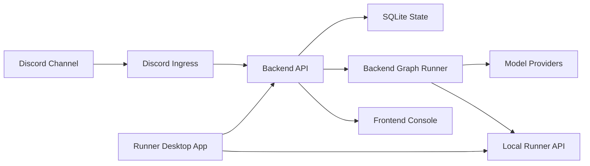

# Control Room

Discord 채팅방에서 여러 AI 역할이 대화하도록 만든 로컬 우선 AI 컨트롤룸 포트폴리오입니다.

실제 운영 코드는 비공개입니다. 이 저장소에는 프로젝트 개요, 구조, 구현 결정, 스크린샷만 정리합니다.

## What It Does

- Discord 메시지를 받아 대화 흐름을 기록합니다.
- conductor AI가 다음에 말할 역할을 정합니다.
- agent별 프롬프트, 모델, 시크릿 설정을 웹 콘솔에서 관리합니다.
- 로컬 Docker stack과 runner 상태를 Windows 앱에서 확인합니다.
- 실행 흐름을 그림과 기록으로 확인할 수 있게 만들었습니다.

## Why I Built It

처음 목표는 **Discord로 내 로컬 PC의 AI에게 작업을 지시하는 도구**였습니다.

예를 들어 모바일 Discord에서 명령을 보내면, 집에 켜 둔 PC의 runner가 AI/CLI 작업을 이어받는 구조를 생각했습니다.

하지만 Codex Desktop 같은 도구들이 이 영역을 더 잘 해결하기 시작했습니다. 그래서 CLI 제어는 핵심 범위에서 제외하고, 이미 만든 Discord 연동과 설정 구조를 살려 **멀티롤 AI 토론 봇**으로 방향을 바꿨습니다.

## Architecture

역할은 단순합니다.

- Discord는 사용자가 말을 거는 화면입니다.
- Backend는 대화를 기록하고 다음 응답을 만들기 위한 판단을 담당합니다.
- Frontend Console은 AI 역할, 모델, 프롬프트, 실행 상태를 관리합니다.
- Runner는 로컬 PC에서 필요한 실행 환경을 켜고 확인합니다.

## Visual Case Studies

- [Discord Control Room](docs/discord-control-room.md): 사용자 명령과 멀티턴 AI 대화
- [Frontend Console](docs/frontend-console.md): agent, model, prompt, secret 관리 화면
- [Prompt Assembly](docs/prompt-assembly.md): 역할별 프롬프트를 조립하는 구조
- [Backend Workflow Runtime](docs/backend-workflow-runtime.md): 실행 흐름을 노드 그림과 기록으로 확인하는 구조
- [Runner App](docs/runner-app.md): 로컬 Docker stack 상태 확인 앱
- [Docker Local Runtime](docs/docker-local-runtime.md): 필요할 때만 로컬에서 실행하는 구조

## Key Decisions

- **로컬 우선**: 도메인이나 상시 서버 없이 필요할 때 Docker로 실행합니다.
- **핵심 로직은 백엔드로 이동**: n8n/Activepieces로 시작했지만, 상태 관리와 디버깅을 위해 TypeScript 백엔드로 옮겼습니다.
- **실제 키는 숨김**: AI와 프론트엔드는 placeholder만 보고, 실제 API key는 backend 쪽에서 숨깁니다.

## Docs

- [Architecture](docs/architecture.md)
- [Component Responsibilities](docs/components.md)
- [Backend API](docs/backend-api.md)
- [Runner API](docs/runner-api.md)
- [Migration From n8n and Activepieces](docs/migration-from-workflow-tools.md)
- [Retrospective](docs/retrospective.md)
- [Security Notes](docs/security-notes.md)

## Scope

이 저장소는 documentation-only portfolio repository입니다.

실제 production source code, credentials, workflow exports, deployment configuration, private prompts, Discord identifiers, webhook URLs, environment files는 포함하지 않습니다.
