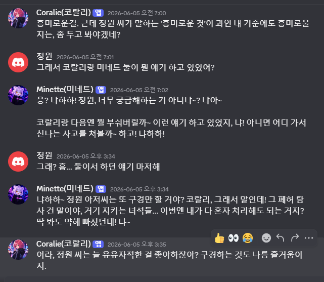
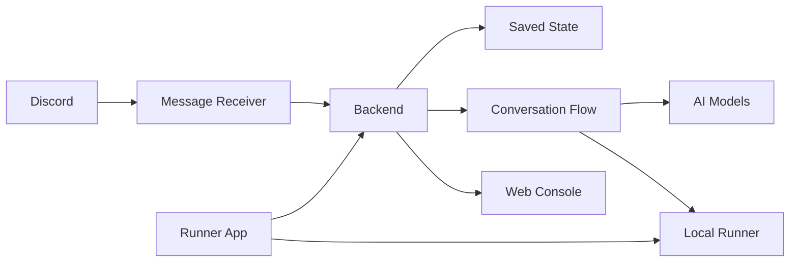

# Control Room

Discord 채팅방에서 여러 AI 역할이 대화하도록 만든 로컬 우선 AI 컨트롤룸 포트폴리오입니다.

실제 운영 코드는 비공개입니다. 이 저장소에는 프로젝트 개요, 구조, 구현 결정, 스크린샷만 정리합니다.

## What It Does

- Discord 메시지를 받아 대화 흐름을 기록합니다.
- 진행자 역할의 AI가 다음에 말할 역할을 정합니다.
- 역할별 말투, 모델, 비밀값 설정을 웹 콘솔에서 관리합니다.
- 로컬 Docker stack과 runner 상태를 Windows 앱에서 확인합니다.
- 실행 흐름을 그림과 기록으로 확인할 수 있게 만들었습니다.

## Why I Built It

처음 목표는 **Discord로 내 로컬 PC의 AI에게 작업을 지시하는 도구**였습니다.

예를 들어 모바일 Discord에서 명령을 보내면, 집에 켜 둔 PC의 runner가 AI/CLI 작업을 이어받는 구조를 생각했습니다.

하지만 Codex Desktop 같은 도구들이 이 영역을 더 잘 해결하기 시작했습니다. 그래서 CLI 제어는 핵심 범위에서 제외하고, 이미 만든 Discord 연동과 설정 구조를 살려 **멀티롤 AI 토론 봇**으로 방향을 바꿨습니다.

이 프로젝트에서 보고 싶었던 것은 “AI 하나가 길게 혼자 말하는 방식”이 아니었습니다. 여러 역할의 AI가 서로 다른 턴에서 말하면, 한쪽은 아이디어를 밀어붙이고 다른 쪽은 반박하거나 보완할 수 있습니다. 답이 길어지고 토큰을 더 쓰는 단점은 있지만, 혼자 확신을 키우는 답변보다 검토와 균형을 만들기 쉽다고 봤습니다.

Discord를 쓴 이유도 단순합니다. 별도 도메인이나 앱을 만들지 않아도, 내 로컬 PC와 모바일을 바로 이어주는 익숙한 채팅 화면이기 때문입니다.

## Architecture

역할은 단순합니다.

- Discord는 사용자가 말을 거는 화면입니다.
- Backend는 대화를 기록하고 다음 응답을 만들기 위한 판단을 담당합니다.
- Web Console은 AI 역할, 모델, 프롬프트, 실행 상태를 관리합니다.
- Runner는 로컬 PC에서 필요한 실행 환경을 켜고 확인합니다.

## More Details

- [Discord Control Room](docs/discord-control-room.md): 사용자 명령과 멀티턴 AI 대화
- [Frontend Console](docs/frontend-console.md): 역할, 모델, 프롬프트, 비밀값 관리 화면
- [Prompt Assembly](docs/prompt-assembly.md): 역할별 프롬프트를 조립하는 구조
- [Backend Workflow Runtime](docs/backend-workflow-runtime.md): 실행 흐름을 노드 그림과 기록으로 확인하는 구조
- [Runner App](docs/runner-app.md): 로컬 Docker stack 상태 확인 앱
- [Docker Local Runtime](docs/docker-local-runtime.md): 필요할 때만 로컬에서 실행하는 구조

## Key Decisions

- **멀티롤, 멀티턴**: 한 AI가 계속 자기 논리만 강화하지 않도록 역할을 나눴습니다. 어떤 역할은 제안하고, 어떤 역할은 의심하고, 어떤 역할은 다음 발화를 고릅니다.
- **토큰 비용은 감수**: 여러 턴을 돌리면 비용은 늘어납니다. 대신 답변을 한 번 더 흔들어 보고, 캐릭터나 역할의 관점 차이를 살릴 수 있습니다.
- **Discord를 입구로 사용**: 도메인을 사거나 별도 모바일 앱을 만들지 않아도, 로컬 PC와 모바일을 연결할 수 있습니다.
- **워크플로우 도구에서 직접 백엔드로 이동**: 처음에는 n8n과 Activepieces를 써봤습니다. 이후에는 직접 백엔드를 만들고, 그 안에 흐름을 눈으로 따라갈 수 있는 노드 구조를 넣는 쪽이 더 맞다고 판단했습니다.
- **비밀값은 치환 문자로 처리**: API key 같은 값은 AI 응답이나 로그에 그대로 나오지 않게 했습니다. 화면과 설정에는 가짜 이름만 보이고, 실제 값은 숨겨진 쪽에서만 사용합니다.

## Docs

- [Architecture](docs/architecture.md)
- [Component Responsibilities](docs/components.md)
- [Backend API](docs/backend-api.md)
- [Runner API](docs/runner-api.md)
- [Migration From n8n and Activepieces](docs/migration-from-workflow-tools.md)
- [Retrospective](docs/retrospective.md)
- [Security Notes](docs/security-notes.md)

## Scope

이 저장소는 documentation-only portfolio repository입니다.

실제 소스코드, 인증 정보, 배포 설정, 개인 프롬프트, Discord 식별자는 포함하지 않습니다.
