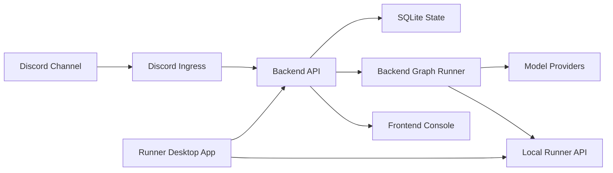

# Control Room

Discord 기반 AI Control Room 프로젝트의 공개 포트폴리오 문서입니다.

Production source code is private. 이 프로젝트는 운영용 workflow, 배포 설정, credential 연동 지점, private automation logic을 포함하기 때문에 실제 소스코드는 공개하지 않고, 이 저장소에는 아키텍처와 구현 의사결정, 회고, 스크린샷만 정리합니다.

## Overview / 프로젝트 개요

Control Room은 Discord를 명령/대화 인터페이스로 사용하고, 백엔드가 AI workflow 실행과 상태 관리를 소유하는 local-first orchestration 프로젝트입니다.

초기 목표는 **Discord를 통해 외부에서 내 로컬 PC의 AI에게 작업을 지시하는 control room**을 만드는 것이었습니다. 예를 들어 모바일 Discord에서 명령을 보내면, 집이나 작업 PC에 떠 있는 로컬 runner가 AI/CLI 작업을 수행하는 구조를 상정했습니다.

다만 제작 도중 Codex Desktop 같은 대기업 도구들이 로컬 PC의 코딩 작업을 더 안정적으로 원격 지시할 수 있는 방향으로 발전하면서, 이 프로젝트에서 CLI 제어 기능을 계속 밀고 가는 실익은 줄어들었습니다. 그래서 CLI control 기능은 핵심 범위에서 제외하고, 프로젝트를 폐기하는 대신 **Discord 안에서 여러 역할의 AI agent가 멀티턴으로 토론하고 응답하는 시스템**에 집중하기로 방향을 전환했습니다.

## Why I Built It / 만든 이유

처음에는 Discord를 단순 채팅 UI가 아니라, 언제 어디서든 접근 가능한 remote command surface로 보고 출발했습니다. 웹 대시보드를 직접 열지 않아도 모바일에서 명령을 보내고, 로컬 PC에서 실행되는 AI runtime이 작업을 이어받는 구조를 만들고 싶었습니다.

이후 프로젝트 방향은 바뀌었습니다. 로컬 CLI 제어는 외부 도구들이 더 빠르게 성숙했기 때문에 직접 구현 우선순위에서 내려놓았고, 대신 이미 만들어둔 Discord ingress, room 설정, prompt compilation, cycle state, model profile 구조를 활용해 **멀티롤 AI 토론 봇**으로 발전시키는 편이 더 의미 있다고 판단했습니다.

이 과정에서 단순한 챗봇보다 중요한 것은 다음이었습니다.

- Discord 메시지를 안정적으로 수집하고 기록하는 것
- 한 채널에서 동시에 여러 cycle이 충돌하지 않게 관리하는 것
- conductor 역할의 agent가 다음 발화자와 대화 지속 여부를 결정하는 것
- assistant agent들이 각자의 역할과 context에 맞게 응답하는 것
- 실행 흐름과 prompt, model call, branch decision을 나중에 추적할 수 있게 만드는 것

## Local-first Deployment / 로컬 우선 실행 방식

이 프로젝트는 처음부터 상시 공개 웹서비스보다 **필요할 때 내 PC에서 Docker stack을 구동하는 방식**을 우선했습니다. 별도 도메인을 구매하거나 클라우드 서버를 항상 켜둘 필요가 없고, 개인용 AI control room에 필요한 비용과 운영 부담을 줄일 수 있기 때문입니다.

동시에 Docker 기반으로 구성했기 때문에 로컬 전용 구조에만 갇히지는 않습니다. 장기적으로는 같은 backend, frontend, runner 구성을 클라우드 VM이나 컨테이너 환경으로 옮겨 상시 실행 서비스처럼 운영할 수 있는 여지를 남겼습니다.

## Preview / Discord 대화 화면

Discord는 이 프로젝트의 main interaction surface입니다. 사용자는 일반 채팅처럼 메시지를 보내고, 백엔드는 채널 메시지를 기록한 뒤 cycle state와 agent role에 따라 여러 AI 캐릭터/역할의 응답을 조율합니다.

## Screenshots

스크린샷은 문서 작업을 진행하면서 필요한 시점에 추가합니다.

| Area | Planned asset | Purpose |
| --- | --- | --- |
| Discord control room | `assets/screenshots/discord-conversation-preview.png` | 사용자 명령과 멀티턴 대화가 일어나는 화면 |
| Frontend console | `assets/screenshots/frontend-console.png` | room, prompt, model, workflow/run 상태를 보는 운영 콘솔 |
| Runner app | `assets/screenshots/runner-app.png` | 로컬 Docker stack, console, runner 상태를 보는 Windows 앱 |
| Backend workflow runtime | `assets/screenshots/workflow-run-trace.png` | node graph, run, trace 구조를 설명하는 workflow debugger |

## Architecture / 아키텍처

백엔드는 durable state, Discord message recording, channel cycle gating, prompt compilation, model/tool resolution, secret masking, graph execution, trace snapshot을 소유합니다. 프론트엔드는 실행 주체가 아니라 설정 편집과 상태 확인을 위한 operator console입니다. runner boundary는 로컬 실행 기능을 브라우저와 분리하기 위한 경계로 설계했습니다.

## Components / 구성 요소

| Component | Role |
| --- | --- |
| Discord Ingress | Discord 메시지를 수신하고 bot/out-of-scope 메시지를 필터링한 뒤 백엔드에 기록합니다. |
| Backend API | 상태, secret reference, channel cycle, graph run, prompt compilation, model call, sanitized trace를 소유합니다. |
| Frontend Console | room/prompt/model 설정, prompt preview, workflow/run 시각화, 수동 점검 화면을 제공합니다. |
| Runner API | 로컬 실행 경계와 readiness check를 제공합니다. CLI 제어는 현재 핵심 범위에서 제외되었습니다. |
| Runner App | Docker stack, frontend console, runner API 상태를 확인하는 Windows launcher/status app입니다. |

자세한 내용: [Component Responsibilities](docs/components.md)

## Migration From Workflow Tools / n8n, Activepieces에서 전환한 이유

초기 구현은 n8n과 Activepieces로 시작했습니다. 백엔드를 직접 구축하는 것보다 workflow engine을 다루는 쪽이 익숙했고, 시각적으로 노드를 연결하면서 Discord, HTTP request, model call, branch logic을 빠르게 검증할 수 있었기 때문입니다.

하지만 channel cycle, user interruption, stale callback, prompt compilation, secret reference, trace snapshot 같은 요구사항이 늘어나면서 workflow tool 안에 핵심 로직을 계속 두는 것이 오히려 불편해졌습니다. AI coding 도구가 발전하면서 TypeScript 백엔드를 직접 구축하는 비용도 낮아졌고, 결국 실행 권한과 상태 관리를 백엔드 코드로 옮기는 방향을 선택했습니다.

자세한 내용: [Migration From n8n and Activepieces](docs/migration-from-workflow-tools.md)

## Case Study Docs

- [Architecture](docs/architecture.md)
- [Component Responsibilities](docs/components.md)
- [Discord Control Room](docs/discord-control-room.md)
- [Backend-owned Workflow Runtime](docs/backend-workflow-runtime.md)
- [Backend API](docs/backend-api.md)
- [Frontend Console](docs/frontend-console.md)
- [Runner App](docs/runner-app.md)
- [Runner API](docs/runner-api.md)
- [Docker Local Runtime](docs/docker-local-runtime.md)
- [Migration From n8n and Activepieces](docs/migration-from-workflow-tools.md)
- [Retrospective](docs/retrospective.md)
- [Security Notes](docs/security-notes.md)

## Repository Scope / 공개 범위

이 저장소는 documentation-only portfolio repository입니다. 실제 production source code, credentials, workflow exports, deployment configuration, private prompts, Discord identifiers, webhook URLs, environment files는 포함하지 않습니다.
