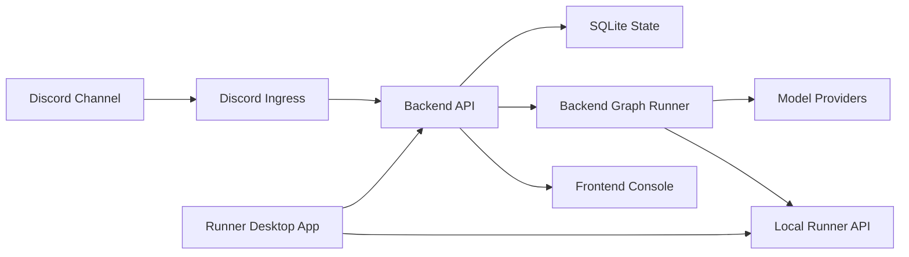

# Control Room

Public technical case study for a private Discord-based AI control room project.

The production source code is intentionally private because the project includes operational workflow details, deployment configuration, credential integration points, and private automation logic. This repository documents the architecture, component responsibilities, migration decisions, and selected screenshots.

## Overview

Control Room is a local-first orchestration system for coordinating Discord conversation ingress, backend-owned AI workflow execution, a frontend operator console, and a local runner boundary.

The project started from workflow-tool prototypes and moved toward a backend-owned TypeScript runtime. The goal was to keep workflow visibility while making state, branching, secret handling, prompt compilation, and runtime execution explicit in code.

## Why I Built It

TBD with project motivation from the author.

Questions to answer before finalizing this section:

- What problem were you personally trying to solve?
- Who was expected to use the control room: only you, a team, or future operators?
- What did Discord provide that a normal web UI did not?
- What was the first moment when n8n or Activepieces stopped being enough?

## Screenshots

Screenshots will be added as the public case study is assembled.

| Area | Planned asset | Purpose |
| --- | --- | --- |
| Discord control room | `assets/screenshots/discord-control-room.png` | Shows the user-facing command and conversation surface. |
| Frontend console | `assets/screenshots/frontend-console.png` | Shows monitoring, configuration, and run visibility. |
| Runner app | `assets/screenshots/runner-app.png` | Shows local operation of Docker stack, console, and runner boundary. |

## Architecture

The backend owns durable state, Discord message recording, channel cycle gating, prompt compilation, model/tool resolution, secret masking, graph execution, and trace snapshots. The frontend is an operator console for editing configuration and inspecting runtime state. The runner boundary isolates local execution from the web console and backend API.

## Components

| Component | Role |
| --- | --- |
| Discord Ingress | Receives Discord messages, filters bot/out-of-scope messages, normalizes payloads, and records them through the backend. |
| Backend API | Owns state, secrets, channel cycles, graph runs, prompt compilation, model calls, and sanitized traces. |
| Frontend Console | Provides configuration editing, prompt previews, workflow/run visualization, and manual inspection. |
| Runner API | Provides a local execution boundary for tool calls and readiness checks. |
| Runner App | Windows desktop launcher/status panel for local Docker stack, frontend console, and runner API. |

More detail: [Component Responsibilities](docs/components.md)

## Migration From Workflow Tools

The project initially explored n8n and Activepieces because they made workflow shape and step-by-step execution easy to see. As the control logic became more stateful, the runtime moved to a backend-owned graph runner so channel cycles, stale callbacks, interruptions, secret references, and trace snapshots could be modeled directly.

More detail: [Migration From n8n and Activepieces](docs/migration-from-workflow-tools.md)

## Case Study Docs

- [Architecture](docs/architecture.md)
- [Component Responsibilities](docs/components.md)
- [Migration From n8n and Activepieces](docs/migration-from-workflow-tools.md)
- [Retrospective](docs/retrospective.md)
- [Security Notes](docs/security-notes.md)

## Repository Scope

This repository is documentation-only. It does not include production source code, credentials, workflow exports, deployment configuration, private prompts, Discord identifiers, webhook URLs, or environment files.
