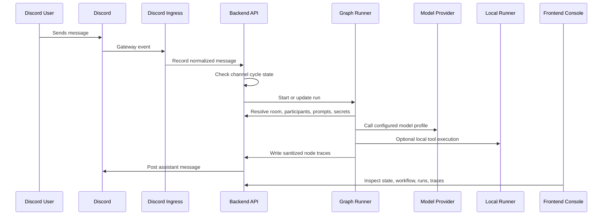

# Architecture

Control Room is a backend-owned orchestration system with a frontend operator console and a local runner boundary.

The core architectural decision is that the backend is the authority for execution. Visual tools were useful during prototyping, but the production direction moved execution, state, branching, and trace generation into code.

## Runtime Flow

## Ownership Model

The backend owns:

- Discord ingress state and channel cycle gating
- room, participant, model profile, tool, prompt, and secret metadata
- prompt compilation
- model/provider request construction
- graph execution and branch decisions
- run and node trace snapshots
- secret masking and secret resolution boundaries

The frontend owns:

- operator-facing configuration screens
- read-only secret status
- prompt previews
- workflow diagram and run trace visualization
- manual refresh and inspection workflows

The runner owns:

- local execution readiness
- tool execution boundary
- workspace and command policy enforcement
- normalized success/error responses for backend calls

## Why Backend-Owned Execution

The project needed workflow visibility without giving a visual workflow runtime final authority over execution. Backend-owned execution made it easier to model:

- one active cycle per Discord channel
- interruption handling while a cycle is running
- stale callback rejection
- prompt compilation and model assignment rules
- sanitized trace records
- secret references such as `{{secret.OPENAI_API_KEY}}`
- provider/tool adapters with stable output shapes

## Current Public Scope

This case study describes the architecture and decisions without publishing the production implementation. Screenshots and diagrams are safe to publish after removing private server names, channel IDs, tokens, webhook URLs, and real personal content.
