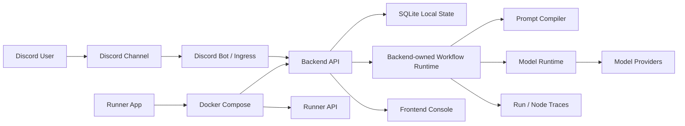
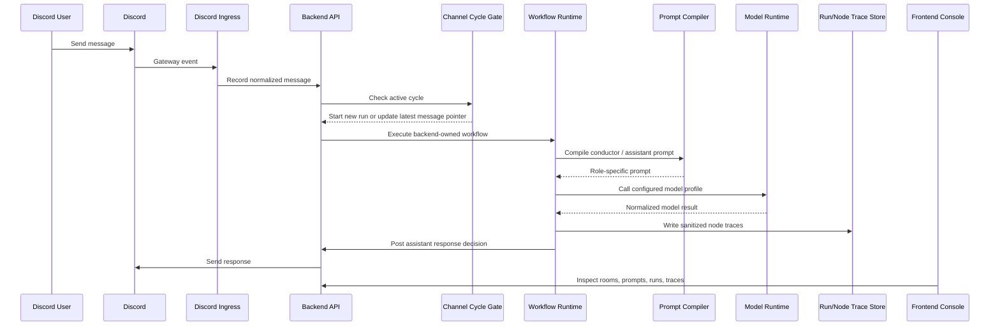
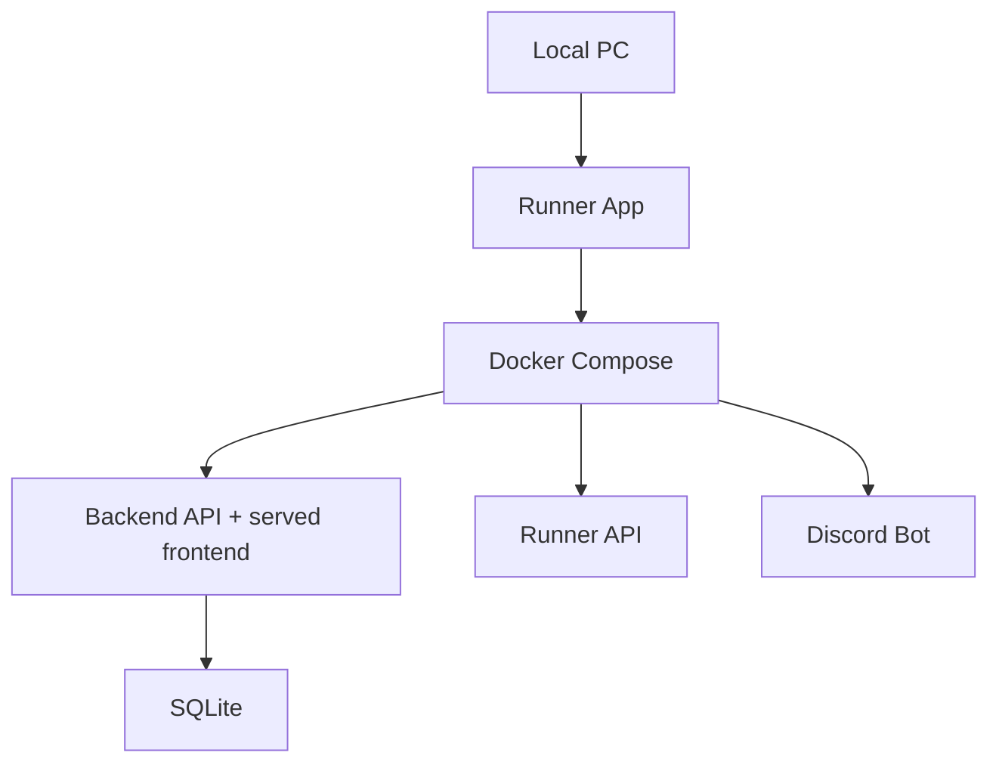

# Architecture / 아키텍처

Control Room은 Discord를 main interaction surface로 사용하고, backend가 conversation workflow 실행과 상태 관리를 소유하는 local-first orchestration system입니다.

핵심 결정은 **실행 권한을 frontend나 외부 workflow tool에 두지 않고 backend code가 소유한다**는 점입니다. n8n/Activepieces prototype에서 얻은 workflow visibility는 유지하되, channel cycle, prompt compilation, model call, trace, secret boundary는 TypeScript backend 안에서 명시적으로 관리하도록 방향을 바꿨습니다.

## System Overview

## Runtime Flow

## Ownership Model

| Layer | Owns | Does not own |
| --- | --- | --- |
| Discord Ingress | Discord gateway event 수신, message normalization, backend로 전달 | workflow 실행 결정, prompt compile, model call |
| Backend API | state, cycle, run, trace, prompt compile, model profile, secret reference | 최종 사용자 UI, local desktop control |
| Workflow Runtime | node graph execution, branch decision, stale cycle check, trace emission | visual editing UI |
| Frontend Console | 설정 편집, prompt fragment 관리, model/secret 상태 확인, run/trace 시각화 | secret resolution, node execution, branch decision |
| Runner API | local execution boundary, readiness check | public API, browser-side command execution |
| Runner App | Docker stack과 local URL 상태 확인 | workflow runtime logic |

## Backend-owned Execution

외부 workflow tool을 사용하면 초기 prototype은 빠르게 만들 수 있지만, 이 프로젝트에서는 다음 요구사항이 backend code에 있어야 했습니다.

- Discord channel별 active cycle을 일관되게 관리
- user interruption이 들어왔을 때 running cycle과 충돌하지 않게 처리
- stale callback이나 이전 model output이 최신 state를 덮어쓰지 않도록 방지
- conductor/assistant prompt를 role별로 다르게 compile
- model profile과 secret reference를 backend에서만 resolve
- frontend가 볼 수 있는 sanitized trace를 안정적으로 저장

그래서 production 방향은 **Backend-owned Workflow Runtime**으로 옮겼습니다. 자세한 내용은 [Backend-owned Workflow Runtime](backend-workflow-runtime.md)에 정리했습니다.

## Local-first Runtime

상시 공개 서버나 도메인을 먼저 준비하지 않고, 필요할 때 로컬 PC에서 Docker stack을 실행하는 구조를 우선했습니다. 개인용 control room으로는 비용과 운영 부담이 낮고, Docker service boundary를 유지했기 때문에 장기적으로 cloud VM/container 환경으로 옮길 여지도 남습니다.

자세한 내용은 [Docker Local Runtime](docker-local-runtime.md)에 정리했습니다.

## Documentation Map

- [Discord Control Room](discord-control-room.md): 사용자가 실제로 보는 Discord 대화 화면
- [Frontend Console](frontend-console.md): agent, model, secret, prompt 설정 UI
- [Prompt Assembly](prompt-assembly.md): conductor/assistant prompt fragment와 backend compile 구조
- [Backend API](backend-api.md): state, cycle, model, secret, run/trace API 책임
- [Backend-owned Workflow Runtime](backend-workflow-runtime.md): node graph 기반 workflow runtime
- [Runner App](runner-app.md): 로컬 실행 상태를 확인하는 Windows app
- [Runner API](runner-api.md): local execution boundary
- [Docker Local Runtime](docker-local-runtime.md): Docker 기반 local-first 운영 구조
- [Migration From n8n and Activepieces](migration-from-workflow-tools.md): workflow tool prototype에서 backend-owned runtime으로 전환한 이유

## Public Scope

이 저장소는 architecture와 case study를 설명하기 위한 공개 포트폴리오입니다. 실제 production source code, credentials, Discord identifiers, webhook URLs, private prompts, deployment details는 포함하지 않습니다.
