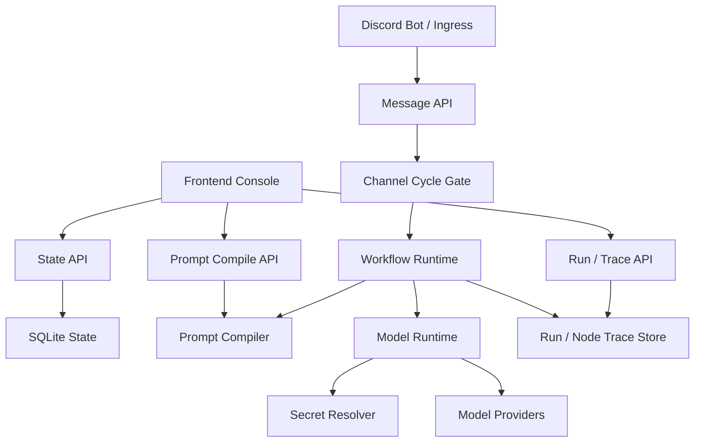
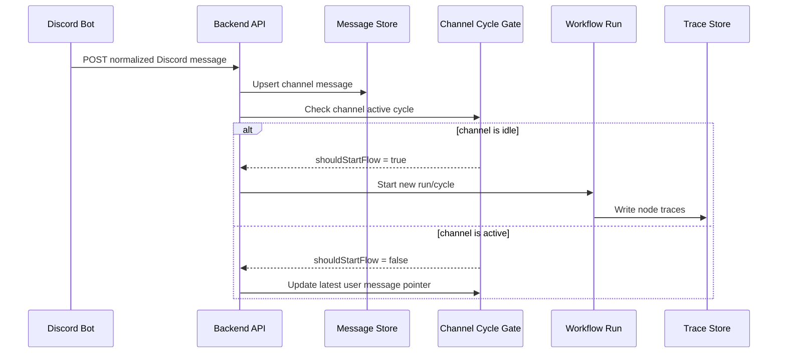
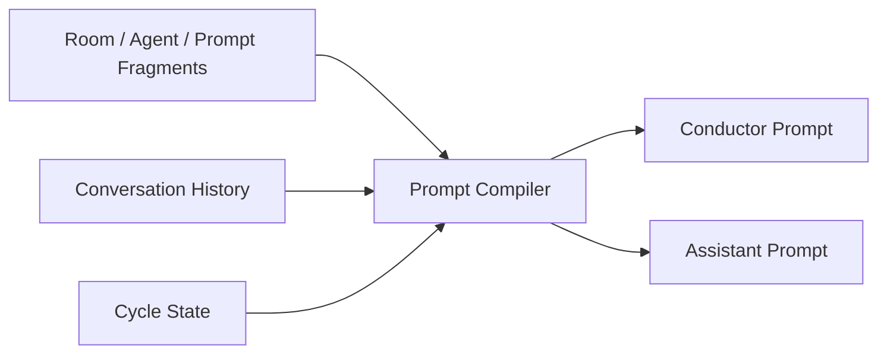

# Backend API

Backend API는 Control Room의 실행 권한과 상태를 소유하는 중심 컴포넌트입니다. Frontend Console, Discord Bot, Runner API는 모두 backend가 정의한 contract를 통해 상태를 읽거나 실행 요청을 전달합니다.

## Responsibility Overview



Backend API는 단순 CRUD 서버가 아닙니다. Discord conversation runtime의 source of truth로서 다음 책임을 갖습니다.

| Responsibility | 설명 |
| --- | --- |
| State API | room, agent, role, model profile, prompt fragment 설정 저장/조회 |
| Discord Message API | Discord ingress payload 기록, latest message 조회 |
| Cycle API | channel별 active/idle 상태, stale cycle protection |
| Prompt Compile API | conductor/assistant prompt를 role별 규칙으로 compile |
| Model Runtime API | model profile과 secret reference를 해석해 provider call 수행 |
| Run/Trace API | workflow run과 node trace를 저장하고 frontend debugger에 제공 |
| Secret Boundary | 실제 secret value는 backend 내부에서만 resolve하고 외부에는 masked/reference 상태로 노출 |

## Discord Message To Run Flow



이 구조의 목적은 Discord 채널에서 여러 user message가 들어와도 backend가 cycle state를 일관되게 유지하는 것입니다. idle 상태에서는 새 run을 시작할 수 있고, active 상태에서는 새 run을 중복 실행하지 않고 latest message pointer만 갱신합니다.

## Channel Cycle 관리

Discord 채널은 비동기 메시지가 계속 들어오는 공간입니다. Backend는 channel별 active cycle을 관리해 다음 문제를 막습니다.

- 같은 채널에서 동시에 여러 run이 시작되는 문제
- 이전 run의 callback이 최신 대화 상태를 덮어쓰는 문제
- 사용자가 새 메시지를 보냈는데 기존 cycle이 이를 모르는 문제

핵심 정책:

- idle channel에 user message가 들어오면 새 cycle/run을 시작할 수 있음
- active channel에 user message가 들어오면 새 run을 시작하지 않고 latest message pointer만 갱신
- cycle update/complete 요청은 active cycle id가 일치할 때만 반영
- stale cycle id를 가진 update는 최신 state를 변경하지 못함

## Model Profile Resolution


Model profile은 provider와 model call 정책을 backend가 해석할 수 있는 설정 객체입니다. Frontend는 profile ID, provider, model name, request parameter, API key secret reference를 편집하지만, 실제 provider 호출과 secret resolution은 backend가 담당합니다.

예를 들어 Gemini profile은 다음 정보를 갖습니다.

- provider: Gemini
- model name: `gemini-3-flash-preview`
- API key secret reference: `GEMINI_API_KEY_TIER1`
- request parameters: temperature, max output tokens, top p, provider-specific JSON

Room이나 agent는 model name을 직접 들고 있기보다 model profile ID를 참조합니다. 따라서 모델을 바꾸고 싶을 때 prompt나 agent definition을 직접 수정하지 않고 profile assignment 또는 profile metadata를 바꾸는 방식으로 교체할 수 있습니다.

## Prompt Compilation

Prompt는 frontend에서 최종 문자열을 직접 조립하지 않습니다. Backend가 room, participants, role instruction, conversation history, cycle state를 바탕으로 conductor/assistant prompt를 compile합니다.



Conductor prompt는 다음 발화자와 cycle 지속 여부를 결정하기 위한 정보를 포함합니다. Assistant prompt는 자기 역할과 대화 history를 중심으로 구성하고, conductor-only 정보는 일반 assistant에게 넘기지 않습니다.

자세한 prompt fragment와 compile 구조는 [Prompt Assembly](prompt-assembly.md) 문서에서 다룹니다.

## Secret Handling


공개 가능한 설정과 실제 secret value를 분리했습니다. 예를 들어 설정에는 다음과 같은 reference만 남깁니다.

```text
{{secret.OPENAI_API_KEY}}
{{secret.DISCORD_ROOM_WEBHOOK}}
{{secret.DISCORD_BOT_TOKEN}}
```

실제 값은 backend runtime에서만 resolve하며, trace나 frontend preview에는 노출하지 않습니다. AI tool이 prompt나 config를 수정하더라도 `{{secret.DISCORD_BOT_TOKEN}}` 같은 reference를 다룰 수 있을 뿐, 실제 key 문자열은 알 수 없습니다. Frontend 역시 configured/empty 상태와 description만 보여주고, 저장된 secret value는 비워 둔 입력란으로 유지합니다.

## Run And Trace API

Workflow runtime은 각 node 실행 결과를 trace로 남깁니다. Frontend Console의 workflow debugger는 이 trace를 읽어 backend 실행 흐름을 시각화합니다.

Trace에는 다음 정보가 포함됩니다.

- run id, workflow id, cycle id
- node id와 node status
- sanitized input/output
- timing
- error type/message
- selected branch 또는 data transfer

이 구조 덕분에 backend code를 직접 따라가지 않아도, 어느 node에서 어떤 payload가 이동했고 어디서 오류가 났는지 frontend에서 확인할 수 있습니다.

## Portfolio Point

Backend API 문서에서 보여주려는 핵심은 이 프로젝트가 단순한 설정 저장 서버가 아니라는 점입니다. Backend는 Discord message lifecycle, cycle state, prompt compile, model call, secret boundary, workflow trace를 모두 소유하는 runtime authority입니다.
