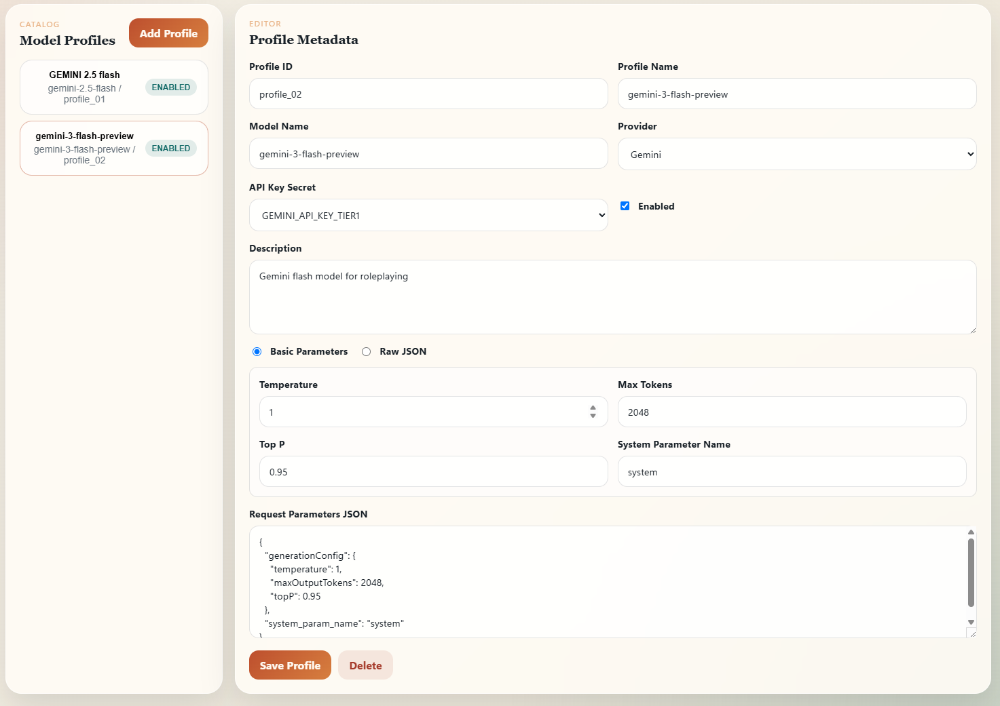
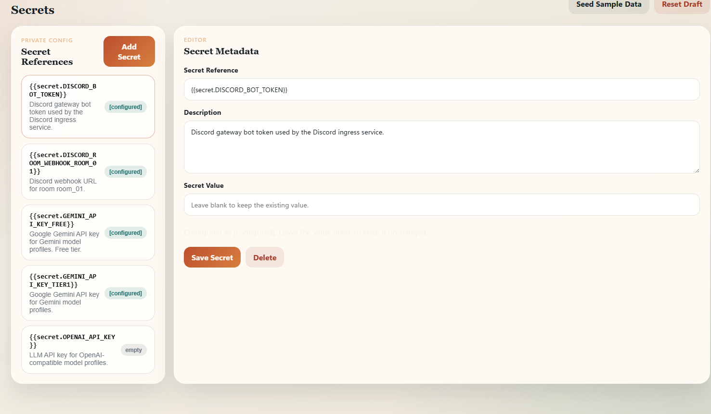

# Backend API

Backend API는 Control Room의 실행 권한과 상태를 소유하는 중심 컴포넌트입니다.

## Screenshot needed

백엔드 자체는 UI 스크린샷보다 구조 설명이 적합합니다. 다만 model profile과 secret reference는 backend runtime contract를 보여주는 frontend 설정 화면으로 설명할 수 있습니다.





Planned assets:

```text
assets/diagrams/backend-api-responsibilities.png
assets/diagrams/backend-api-sequence.png
```

필요한 이미지:

- Backend API가 Discord ingress, frontend, runner, model provider와 연결되는 구조
- message recording부터 run/trace 저장까지의 sequence diagram

## 역할

Backend API는 frontend나 Discord bot이 직접 실행 결정을 내리지 않도록 중앙 authority 역할을 합니다. room 설정, agent 구성, model profile, prompt fragment, channel cycle, run, node trace, secret reference를 관리하고, workflow runtime이 사용할 수 있는 형태로 제공합니다.

## 주요 책임

| Responsibility | 설명 |
| --- | --- |
| State API | room, agent, role, model profile, prompt 설정 저장/조회 |
| Discord message API | channel message 기록, latest message 조회 |
| Cycle API | channel별 active/idle 상태와 stale cycle 보호 |
| Prompt compile API | conductor/assistant prompt를 role별 규칙에 따라 생성 |
| Model runtime API | model profile과 secret reference를 해석해 provider call 수행 |
| Run/Trace API | workflow run과 node trace를 저장하고 frontend에 제공 |
| Secret boundary | 실제 secret value는 backend 내부에서만 resolve하고 외부에는 masked 상태로 노출 |

## Model profile resolution

Model profile은 provider와 model call 정책을 backend가 해석할 수 있는 설정 객체입니다. frontend는 profile ID, provider, model name, request parameter, API key secret reference를 편집하지만, 실제 provider 호출과 secret resolution은 backend가 담당합니다.

예를 들어 Gemini profile은 다음 정보를 갖습니다.

- provider: Gemini
- model name: `gemini-3-flash-preview`
- API key secret reference: `GEMINI_API_KEY_TIER1`
- request parameters: temperature, max output tokens, top p, provider-specific JSON

room이나 agent는 model name을 직접 들고 있기보다 model profile ID를 참조합니다. 따라서 모델을 바꾸고 싶을 때 prompt나 agent definition을 직접 수정하지 않고 profile assignment 또는 profile metadata를 바꾸는 방식으로 교체할 수 있습니다.

## Channel cycle 관리

Discord 채널은 비동기 메시지가 계속 들어오는 공간입니다. backend는 channel별 active cycle을 관리해 다음 문제를 막습니다.

- 같은 채널에서 동시에 여러 run이 시작되는 문제
- 이전 run의 callback이 최신 대화 상태를 덮어쓰는 문제
- 사용자가 새 메시지를 보냈는데 기존 cycle이 이를 모르는 문제

핵심 정책:

- idle channel에 user message가 들어오면 새 cycle/run을 시작할 수 있음
- active channel에 user message가 들어오면 새 run을 시작하지 않고 latest message pointer만 갱신
- cycle update/complete 요청은 active cycle id가 일치할 때만 반영

## Prompt compilation

prompt는 frontend에서 문자열을 조립하지 않습니다. backend가 room, participants, role instruction, conversation history, cycle state를 바탕으로 conductor/assistant prompt를 compile합니다.

Conductor prompt는 다음 발화자와 cycle 지속 여부를 결정하기 위한 정보를 포함합니다. Assistant prompt는 자기 역할과 대화 history를 중심으로 구성하고, conductor-only 정보는 일반 assistant에게 넘기지 않습니다.

자세한 prompt fragment와 compile 구조는 [Prompt Assembly](prompt-assembly.md) 문서에서 다룹니다.

## Secret handling

공개 가능한 설정과 실제 secret value를 분리했습니다. 예를 들어 설정에는 다음과 같은 reference만 남깁니다.

```text
{{secret.OPENAI_API_KEY}}
{{secret.DISCORD_ROOM_WEBHOOK}}
```

실제 값은 backend runtime에서만 resolve하며, trace나 frontend preview에는 노출하지 않습니다.

이 구조에서 AI가 볼 수 있는 값은 placeholder뿐입니다. AI tool이 prompt나 config를 수정하더라도 `{{secret.DISCORD_BOT_TOKEN}}` 같은 reference를 다룰 수 있을 뿐, 실제 key 문자열은 알 수 없습니다. frontend 역시 configured/empty 상태와 description만 보여주고, 저장된 secret value는 비워 둔 입력란으로 유지합니다.

## 포트폴리오에서 보여주려는 점

이 문서는 backend가 단순 CRUD 서버가 아니라, Discord conversation runtime의 authority라는 점을 설명합니다.
