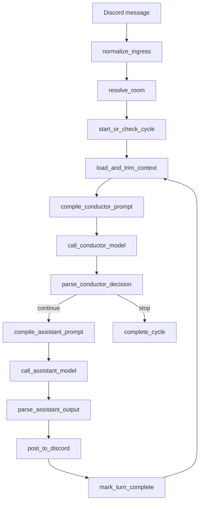

# Backend-owned Workflow Runtime

이 문서에서 말하는 workflow runtime은 n8n이나 Activepieces 같은 외부 workflow tool이 아니라, backend 내부에 직접 구현한 node graph 실행 구조입니다.

## Screenshot needed

Planned asset:

```text
assets/diagrams/backend-workflow-runtime.png
```

필요한 이미지:

- Discord message가 backend run으로 들어오는 흐름
- conductor node, assistant node, branch decision, post-to-discord node가 이어지는 graph
- 각 node 실행 결과가 trace로 저장되는 구조

## 왜 필요했나

초기 prototype에서는 n8n과 Activepieces가 workflow의 시각성과 실행 순서 확인을 제공했습니다. 하지만 실제 구현에서는 다음 요구사항이 backend code 안에서 명시적으로 다뤄져야 했습니다.

- 한 Discord channel에 하나의 active cycle만 허용
- cycle 실행 중 새 user message가 들어올 때 interruption 처리
- 오래된 callback이나 model output이 최신 cycle을 덮어쓰지 않도록 stale check
- conductor와 assistant의 prompt compile 규칙 분리
- model profile과 secret reference 해석
- node별 input/output, branch decision, error를 trace로 저장

그래서 외부 workflow runtime 대신, backend가 workflow definition과 execution authority를 직접 소유하도록 구조를 바꿨습니다.

## 핵심 개념

| Concept | 설명 |
| --- | --- |
| Workflow definition | backend가 소유하는 기본 Discord conversation workflow |
| Node | normalize ingress, resolve room, compile prompt, call model, parse output 같은 실행 단위 |
| Edge | node 사이의 흐름 또는 branch decision |
| Run | 특정 Discord message/cycle에서 시작된 workflow 실행 |
| Trace | 각 node의 상태, sanitized input/output, timing, error, selected branch 기록 |
| Cycle | Discord channel 단위의 대화 진행 상태 |

## 대표 실행 흐름



## 외부 workflow tool과 다른 점

| 외부 workflow tool | Backend-owned runtime |
| --- | --- |
| 시각적 node 편집기가 실행 주체 | backend code가 실행 주체 |
| step payload가 tool 내부 규칙에 묶임 | run envelope와 trace contract를 직접 정의 |
| credential이 workflow connection에 묶임 | secret reference를 backend가 해석하고 mask |
| branch/debug가 tool UI에 의존 | frontend가 backend trace를 시각화 |
| prototype에 강함 | 테스트, versioning, runtime control에 강함 |

## 포트폴리오에서 보여주려는 점

이 문서는 프로젝트가 단순 Discord bot이 아니라, conversation workflow를 backend가 직접 실행하고 추적하는 orchestration system이라는 점을 보여주기 위한 문서입니다.
