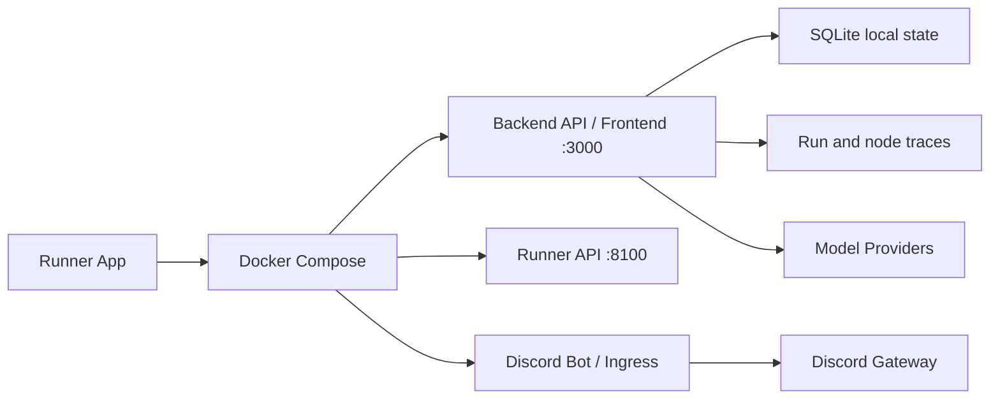

# Docker Local Runtime

Control Room은 필요할 때 로컬 PC에서 Docker stack을 구동하는 local-first runtime을 우선했습니다.

## Screenshot

Docker Desktop의 container view는 이 프로젝트가 상시 cloud service가 아니라, 필요할 때 local Docker runtime으로 실행되는 구조라는 점을 보여줍니다. 이 문서에서는 스크린샷보다 service boundary와 runtime shape를 중심으로 설명합니다.

## 왜 local-first인가

이 프로젝트는 개인용 AI control room 성격이 강했습니다. 따라서 처음부터 도메인을 구매하고 클라우드 서버를 상시 운영하기보다, 필요할 때 내 PC에서 실행하는 방식이 더 현실적이었습니다.

장점:

- 도메인 구매가 필요 없음
- 상시 cloud server 비용이 없음
- 개인 credential과 local runtime을 외부에 노출하지 않음
- 개발/실험 속도가 빠름
- Docker로 실행 환경을 반복 가능하게 유지

## Docker를 선택한 이유

Docker는 local-first와 future cloud deployment 사이의 절충점이었습니다. 로컬 PC에서 실행하더라도 backend, frontend, runner를 service 단위로 분리할 수 있고, 나중에 cloud VM이나 container platform으로 옮길 가능성을 남길 수 있습니다.

## Runtime shape

Backend API는 frontend static files를 함께 제공하고, Discord ingress와 runner boundary는 별도 service로 분리됩니다. 로컬 환경에서는 Compose가 이 service들을 한 번에 띄우는 entry point가 됩니다.

## Runtime 구성

| Service | 설명 |
| --- | --- |
| Backend API | state, prompt, cycle, run, trace, model/runtime API |
| Frontend Console | operator UI |
| Runner API | local execution boundary와 readiness endpoint |
| Discord Bot / Ingress | Discord gateway message ingress |
| SQLite | local-first state store |

## 운영 방식

일상적인 사용에서는 다음 흐름을 상정했습니다.

1. 필요할 때 Runner App 또는 terminal에서 Docker stack을 실행합니다.
2. Backend API와 Frontend Console이 localhost에서 열립니다.
3. Discord Bot이 gateway event를 받아 backend에 message를 기록합니다.
4. Backend workflow runtime이 cycle/run/trace를 관리합니다.
5. 작업이 끝나면 Docker stack을 내릴 수 있습니다.

이 방식은 개인 프로젝트나 실험용 control room에 적합합니다. 공개 도메인을 유지할 필요가 없고, 외부 트래픽을 받는 상시 서버를 줄일 수 있습니다.

## Cloud migration 가능성

현재 구조는 local-first이지만, Docker 기반이므로 장기적으로는 다음 형태로 옮길 수 있습니다.

- single cloud VM에서 Docker Compose로 운영
- container hosting 환경에 backend/frontend/runner 분리 배포
- Discord ingress만 cloud에 두고 runner는 local에 유지
- database를 SQLite에서 managed database로 교체

포트폴리오에서는 이 부분을 “지금은 개인용 local runtime으로 단순하게 시작했지만, 서비스 경계는 cloud migration을 고려해 나눴다”는 설계 판단으로 설명할 수 있습니다.

## 포트폴리오에서 보여주려는 점

Docker Local Runtime 문서는 이 프로젝트가 단순히 로컬에서 우연히 돌아가는 앱이 아니라, backend, frontend, runner, Discord ingress를 service boundary로 나눠 local-first로 운영하도록 설계했다는 점을 보여줍니다. 동시에 Docker 기반이므로 장기적으로 cloud VM이나 container platform으로 이전할 수 있는 여지도 남겨두었습니다.
