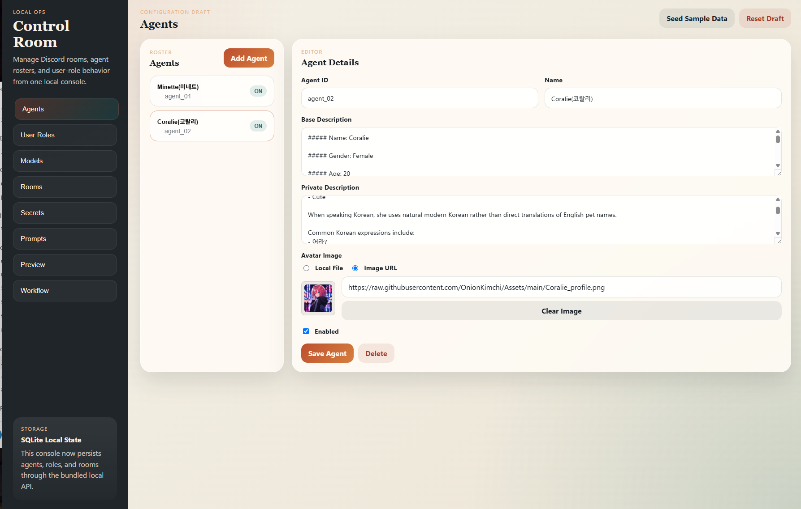

# Frontend Console

Frontend Console은 Control Room의 operator UI입니다. 실행 권한을 갖는 runtime이 아니라, backend state와 run trace를 편집/검사하는 도구입니다.

## Screenshot

이 화면은 여러 AI agent 중 하나의 prompt/persona 상태가 frontend console에서 관리되는 모습을 보여줍니다. agent roster, base/private description, avatar image, enabled 상태처럼 Discord 대화에 반영되는 설정을 운영자가 직접 확인하고 수정할 수 있습니다.

## Model profile configuration

Model profile 화면은 provider, model name, parameter, API key secret reference를 분리해서 관리하는 설정 UI입니다. 특정 agent나 room이 어떤 model profile을 사용할지 바꾸면 backend runtime은 해당 profile의 provider/model/parameter 조합을 사용해 model call을 수행합니다.

이 구조 덕분에 prompt나 agent 설정을 바꾸지 않고도 Gemini, OpenAI-compatible, Anthropic, custom endpoint 같은 provider 구성을 교체할 수 있습니다. temperature, max tokens, top p 같은 기본 parameter는 UI에서 편집하고, provider별 세부 request shape는 JSON으로 확인할 수 있게 했습니다.

## Secret reference configuration

Secret 화면은 실제 key를 직접 노출하지 않고 `{{secret.NAME}}` placeholder와 configured/empty 상태만 보여줍니다. AI 도구나 frontend는 `{{secret.GEMINI_API_KEY_TIER1}}`, `{{secret.DISCORD_BOT_TOKEN}}` 같은 reference만 다루며, 실제 secret value는 backend runtime에서만 resolve됩니다.

이 설계는 prompt preview, trace, workflow debugger에 실제 API key나 webhook URL이 섞이지 않도록 하기 위한 핵심 보안 경계입니다.

## 역할

Frontend Console은 사용자가 backend 상태를 다루기 쉽게 만드는 layer입니다. 실제 workflow 실행, secret resolution, model call, branch decision은 backend가 소유합니다.

## 주요 기능

| Feature | 설명 |
| --- | --- |
| Room configuration | room context, participant, role, max turn, channel binding 설정 |
| Agent management | agent별 이름, 역할, instruction, model profile 지정 |
| Persona editing | agent별 base/private description과 avatar metadata 관리 |
| Prompt preview | backend가 compile한 conductor/assistant prompt를 read-only로 확인 |
| Model/tool assignment | room 또는 agent에 model profile과 tool catalog 항목 연결 |
| Model profile editing | provider, model name, request parameter, API key secret reference 관리 |
| Workflow visualization | backend-owned workflow definition을 시각화 |
| Run inspection | run status, node trace, sanitized input/output, error 확인 |
| Secret status | 실제 secret value 없이 configured/missing 상태만 표시 |

## 왜 frontend가 실행 주체가 아닌가

이 프로젝트에서 frontend는 operator console입니다. frontend가 node 실행, branch decision, secret resolution을 직접 수행하면 다음 문제가 생깁니다.

- secret value가 browser로 노출될 위험
- workflow 실행 로직이 UI 상태와 섞임
- Discord ingress와 runner가 같은 execution authority를 공유하기 어려움
- trace와 stale-cycle protection을 일관되게 유지하기 어려움

그래서 frontend는 backend API를 통해 상태를 편집하고 실행 결과를 관찰하는 역할로 제한했습니다.

## 포트폴리오에서 보여주려는 점

Frontend Console 문서는 이 프로젝트가 Discord 채팅 화면만 있는 것이 아니라, 운영자가 system state와 workflow execution을 검사할 수 있는 관리 화면까지 고려했다는 점을 보여줍니다.
