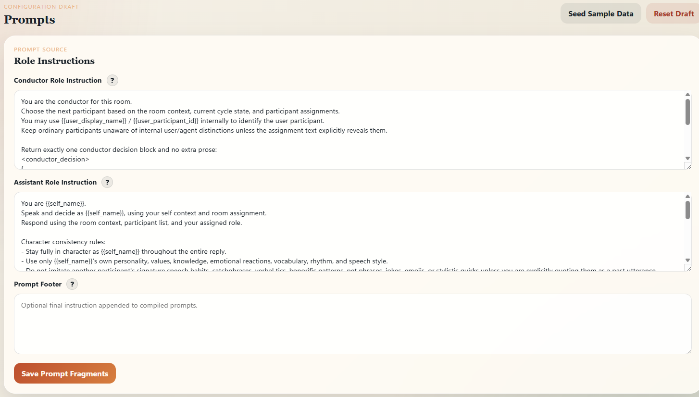
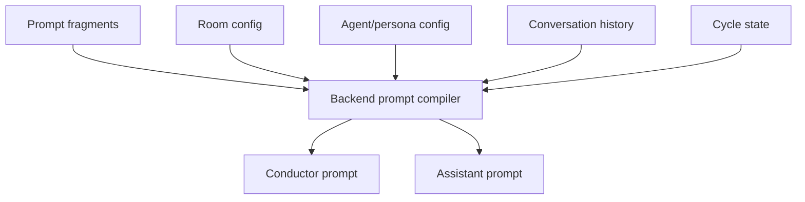

# Prompt Assembly

Control Room의 prompt는 frontend에서 최종 문자열을 직접 만드는 방식이 아니라, frontend가 editable fragment를 관리하고 backend가 runtime state와 합쳐 compile하는 방식입니다.

## Screenshot

이 화면은 conductor와 assistant의 role instruction fragment를 관리하는 설정 UI입니다. 운영자는 역할별 지시문을 수정할 수 있지만, 실제 최종 prompt 조립은 backend가 room context, participant list, conversation history, cycle state와 함께 수행합니다.

## 왜 fragment로 나눴나

멀티롤 대화에서는 모든 agent에게 같은 prompt를 주면 안 됩니다. conductor는 다음 발화자와 cycle 지속 여부를 결정해야 하고, assistant는 자신의 persona와 대화 맥락에 맞게 응답해야 합니다.

그래서 prompt source를 다음처럼 나누었습니다.

| Fragment | 용도 |
| --- | --- |
| Conductor role instruction | 다음 참여자 선택, cycle 지속 여부, decision block 형식 강제 |
| Assistant role instruction | 자기 역할, persona 유지, 응답 스타일 규칙 |
| Prompt footer | 공통 final instruction을 필요할 때 추가 |
| Agent description | agent별 base/private description |
| Room context | room 목적, 참여자, 설정 정보 |
| Conversation history | Discord에서 기록된 대화 맥락 |
| Cycle state | 현재 turn, active cycle, interruption 여부 |

## Backend compile 방식

Frontend는 fragment와 설정을 저장하고, backend는 실행 시점에 필요한 값을 모아 prompt를 compile합니다.

Conductor prompt는 대화 진행을 통제하는 hidden coordinator 역할에 가깝습니다. Assistant prompt는 선택된 agent가 자신의 역할과 persona에 맞게 말하도록 구성됩니다.

## Conductor와 assistant의 차이

| Role | 포함되는 정보 | 목적 |
| --- | --- | --- |
| Conductor | room context, participant list, current event, cycle state, conductor instruction | 다음 발화자와 cycle 지속 여부 결정 |
| Assistant | room context, participant list, self context, conversation history, assistant instruction | 선택된 agent의 실제 응답 생성 |

Conductor-only 정보는 일반 assistant prompt에 그대로 들어가지 않도록 분리합니다. 이렇게 해야 coordinator 역할과 participant 역할이 섞이지 않고, 각 agent가 자기 역할에 맞는 context만 받습니다.

## Placeholder와 secret boundary

Prompt fragment는 `{{self_name}}`, `{{user_display_name}}`, `{{user_participant_id}}` 같은 placeholder를 포함할 수 있습니다. 이런 값은 compile 시점에 backend가 안전하게 치환합니다.

Secret value는 prompt fragment에 직접 들어가지 않습니다. secret이 필요한 설정은 `{{secret.NAME}}` reference로만 다루고, 실제 값은 backend runtime에서만 resolve합니다.

## 포트폴리오에서 보여주려는 점

이 문서는 Control Room이 단순히 “긴 system prompt 하나”로 동작하는 것이 아니라, role별 fragment와 runtime state를 조립해 conductor/assistant prompt를 생성하는 구조라는 점을 보여줍니다.
