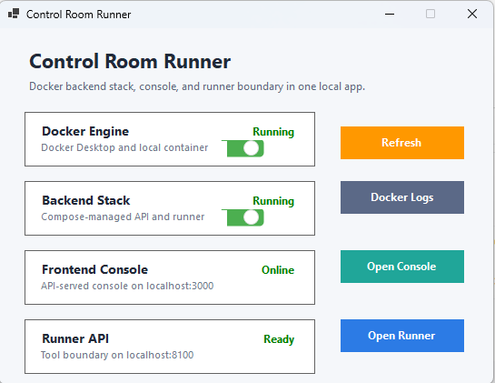

# Runner App

Runner App은 로컬 PC에서 Control Room runtime을 쉽게 확인하고 실행하기 위한 Windows desktop utility입니다.

## Screenshot

이 화면은 Docker Engine, Backend Stack, Frontend Console, Runner API의 상태를 한 곳에서 확인하는 local operation panel입니다.

## 역할

초기 프로젝트 목표는 Discord를 통해 원격에서 로컬 PC의 AI/CLI runtime에 작업을 지시하는 것이었습니다. 이때 로컬 PC 쪽 runtime을 쉽게 켜고 상태를 확인할 수 있는 작은 desktop app이 필요했습니다.

현재 CLI control은 핵심 기능에서 제외되었지만, Runner App은 여전히 local-first runtime을 설명하는 좋은 구성 요소입니다.

## 주요 기능

| Feature | 설명 |
| --- | --- |
| Docker Engine status | Docker Desktop과 local container runtime 상태 확인 |
| Backend Stack status | compose로 관리되는 backend/runner service 상태 확인 |
| Frontend Console shortcut | local console URL 열기 |
| Runner API shortcut | runner readiness endpoint 열기 |
| Docker logs | backend/runner container log 확인 |

## 왜 필요한가

이 프로젝트는 상시 cloud service보다 필요할 때 로컬 PC에서 구동하는 방식을 우선했습니다. Runner App은 사용자가 terminal command를 매번 기억하지 않아도 local runtime 상태를 확인하고 필요한 화면으로 이동할 수 있게 해줍니다.

## 포트폴리오에서 보여주려는 점

Runner App 문서는 이 프로젝트가 backend/frontend만 만든 것이 아니라, 실제 local operation 경험까지 고려했다는 점을 보여줍니다.
